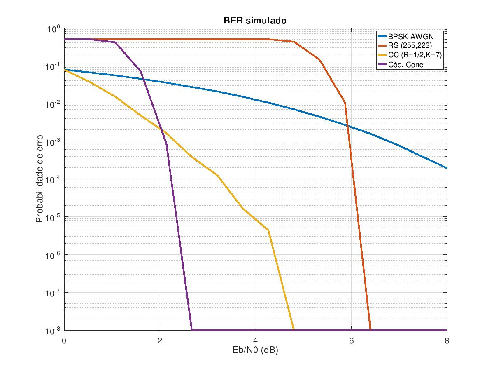

# Códigos Corretores de Erro UFPE 2023.2

Código-fonte das atividades da disciplina de Códigos Corretores de Erro UFPE 2023.2.

## Pasta ProjetoFinal

Essa pasta contém o código-fonte da simulação, utilizando o IT++, do sistema de comunicação da Voyager, que consistem na concatenação de:

* Um código Reed-Solomon(255, 223)
* Um código convolucional (R=1/2, K=7)

O código RS(255,223) é decodificado usando _Hard decoding_ enquanto que o código convolucional é decodificado usando o algoritmo de Viterbi.

A saída final do código deve ser algo do seguinte formato:


Figura 1: Resultado da simulação

### Compilando o projeto final

Para compilar, é necessário satisfazer as seguintes dependências:
* GCC e GNU Make
* Biblioteca do IT++
* Octave para geração das curvas

Para instalar todas as dependências, basta instalar os pacotes `build-essential`, `libitpp-dev` e `octave`

```sh
sudo apt install build-essential libitpp-dev octave
```

Depois disso, basta compilar o projeto

```sh
make -j
```

### Gerando os resultados

Depois de compilar os resultados são gerados como arquivos CSV. Para obter os arquivos CSV basta executar o programa `main`:

```sh
./main
```

Os gráficos podem ser gerados executando o seguinte comando

```sh
octave-cli gera-graficos.m
```

A imagem será gerada em um arquivo chamado `output.jpg`